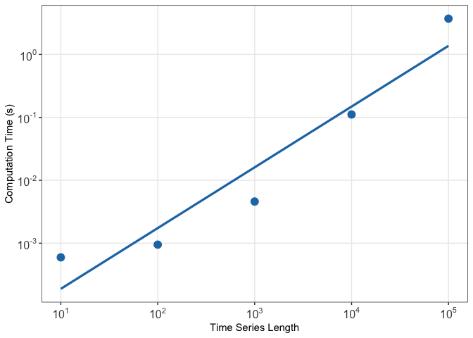

# Rcatch22 

[](https://www.r-pkg.org/pkg/Rcatch22)
[](https://www.r-pkg.org/pkg/Rcatch22)
[](https://zenodo.org/badge/latestdoi/353530083)

R package for the calculation of [22 CAnonical Time-series
CHaracteristics](https://github.com/DynamicsAndNeuralSystems/catch22).
The package is an efficient implementation that calculates time-series
features coded in C.

## Installation

You can install the stable version of `Rcatch22` from CRAN using the
following:

``` r
install.packages("Rcatch22")
```

You can install the development version of `Rcatch22` from GitHub using
the following:

``` r
devtools::install_github("hendersontrent/Rcatch22")
```

You might also be interested in a related R package called
[`theft`](https://github.com/hendersontrent/theft) (Tools for Handling
Extraction of Features from Time series) which provides standardised
access to `Rcatch22` and 5 other feature sets (including 3 feature sets
from Python libraries) for a total of \~1,200 features. `theft` also
includes extensive functionality for processing and analysing
time-series features, including automatic time-series classification,
top performing feature identification, and a range of statistical data
visualisations.

## Wiki

Please open the included vignette within an R environment or visit the
detailed [`Rcatch22`
Wiki](https://github.com/hendersontrent/Rcatch22/wiki/) for information
and tutorials.

## Computational performance

With features coded in C, `Rcatch22` is highly computationally
efficient, scaling nearly linearly with time-series size. Computation
time in seconds for a range of time series lengths is presented below.

<!-- -->

## catch24

An option to include the mean and standard deviation as features in
addition to `catch22` is available through setting the `catch24`
argument to `TRUE`:

``` r
features <- catch22_all(x, catch24 = TRUE)
```

## Citation

A DOI is provided at the top of this README. Alternatively, the package
can be cited using the following:


    To cite package 'Rcatch22' in publications use:

      Trent Henderson (2022). Rcatch22: Calculation of 22 CAnonical
      Time-Series CHaracteristics. R package version 0.2.1.

    A BibTeX entry for LaTeX users is

      @Manual{,
        title = {Rcatch22: Calculation of 22 CAnonical Time-Series CHaracteristics},
        author = {Trent Henderson},
        year = {2022},
        note = {R package version 0.2.1},
      }

Please also cite the original *catch22* paper:

-   [Lubba et al. (2019). catch22: CAnonical Time-series
    CHaracteristics.](https://link.springer.com/article/10.1007/s10618-019-00647-x/)
